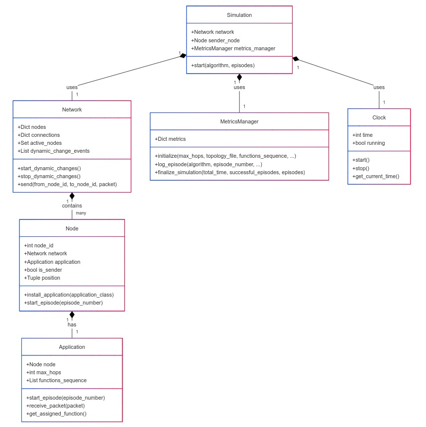

# Getting Started

Welcome to **MeshRoutingLab**! This project is a mesh network simulation framework designed to implement, compare, and analyze routing algorithms such as Q-Routing, Dijkstra, and Bellman-Ford. Whether you're a researcher, student, or developer, this guide will help you understand how the project works and how you can use it.

---

## How Does It Work?

The project follows a class structure and hierarchy inspired by **NS-3**, a popular network simulator. Here's a simplified breakdown of how everything fits together:

### 1. **The Big Picture**
   - **MeshRoutingLab** simulates a network of devices (called **nodes**) that communicate with each other by sending packets.
   - Each node runs a **routing algorithm** (like Q-Routing or Dijkstra) to decide how to forward packets through the network.
   - The simulation tracks metrics like packet delivery success, latency, and network changes over time.

### 2. **Key Components**
   - **Network**: Represents the entire mesh network. It contains all the nodes and manages their connections.
   - **Node**: Represents a single device in the network. Each node can send, receive, and forward packets.
   - **Application**: Implements a routing algorithm (e.g., Q-Routing). Each node runs one application.
   - **Simulation**: Manages the entire simulation process, from starting the network to collecting results.
   - **MetricsManager**: Tracks and logs data about the simulation, such as packet delivery rates and latency.
   - **Clock**: Keeps track of simulation time, ensuring all events happen in the correct order.

### 3. **How It All Fits Together**
   - You start by defining a **network topology** (how nodes are connected) and choosing a **routing algorithm**.
   - The simulation runs for a set number of **episodes**, where each episode represents a packet being sent from one node to another.
   - During the simulation, nodes use their routing algorithms to decide where to send packets. The **MetricsManager** logs all the important data.
   - At the end, you get a detailed report of how well the network performed.

Now that you have a high-level understanding of how **MeshRoutingLab** works, let's dive deeper into the details. The following sections will explain installation, guide you through examples, show you the class structure, simulation flow, etc.

## Installation

To set up the project, first, clone the repository and install the dependencies:

```sh
# Clone the repository
git clone git@github.com:FrancoBre/esp-q-mesh-routing.git
cd mesh-routing-lab

# Install dependencies
pip install -r requirements.txt
```

## Running Simulations

Example simulation scripts are provided in the `examples/` directory. Choose one of the following difficulty levels:

### Easy Mode
```sh
bash examples/easy.sh
```

### Medium Mode
```sh
bash examples/medium.sh
```

### Hard Mode
```sh
bash examples/hard.sh
```

These scripts execute simulations with different levels of complexity based on topology, packet constraints, and network dynamics.

To model these scenarios, the simulation uses configurable parameters that allows you to adjust network behavior and evaluate routing performance under various conditions.

| Parameter                    | Description |
|------------------------------|-------------|
| **Number of Episodes**       | Defines the number of simulation runs, where each episode sends a single packet through the network. |
| **Max Hops per Episode**     | Specifies the maximum number of hops a packet can take before being discarded. |
| **Mean Interval for Dynamic Events** | The average time (exponential distribution) between random disconnections in the network. |
| **Reconnect Interval**       | The average time (exponential distribution) before a disconnected node rejoins the network. |
| **Node Disconnection Probability** | Probability of a node disconnecting during a dynamic network event. |
| **Function Sequence**        | Ordered list of functions a packet must process during routing. |
| **Topology File**            | YAML file defining the network’s node positions and connections. |
| **Algorithm**                | The routing algorithm used in the simulation (Q-Routing, Dijkstra, Bellman-Ford). |
| **Q-Routing Penalty**        | The penalty applied in Q-Routing when a packet fails to complete its function sequence. |

### Network Modeling

- **Mean Interval & Reconnection**: Higher values for `mean_interval_ms` result in fewer disconnections, creating a more stable network, while lower values for `mean_reconnect_ms` enable faster reconnections, reducing fragmentation.
- **Max Hops**: Limits how far a packet can travel before it is discarded.
- **Topology Definition**: Defined in a YAML file, which provides 3D coordinates for nodes and connectivity details.

#### Example YAML Topology
```yaml
nodes:
  - id: 1
    position: [0.0, 0.0, 0.0]
  - id: 2
    position: [5.0, 1.0, 0.0]
  - id: 3
    position: [10.0, 3.0, 2.0]
```
Distances between nodes are calculated using Euclidean distance, and latency is modeled using Friis' transmission equation for signal propagation.

## Viewing Results

Once a simulation is completed, you can visualize the results using the built-in animator:

```sh
python src/utils/simulation_animator.py
```

This will run an animation for the latest run.

Also, the results of each simulation are stored in a structured JSON file that contains detailed information about the execution:

- **Simulation Parameters**: Configuration parameters such as max hops, topology file, function sequence, etc.
- **Packet Routes**: The full path each packet took through the network, including nodes visited and their assigned functions, information about packet success, and latency for every algorithm run.

### Example JSON Structure
```json
{
    "simulation_id": 1,
    "parameters": {
        "max_hops": 10,
        "algorithms": ["Q_ROUTING", "DIJKSTRA", "BELLMAN_FORD"],
        "topology_file": "../resources/topologies/6x6_grid_topology.yaml",
        "functions_sequence": ["A", "B", "C", "D"]
    },
    "total_time": 433,
    "Q_ROUTING": {
        "success_rate": 0.8,
        "episodes": [
            {
                "episode_number": 1,
                "route": [
                    {"from": 0, "to": 6, "function": "A", "latency": 0.001},
                    {"from": 6, "to": 7, "function": "B", "latency": 0.002}
                ]
            }
        ]
    }
}
```

You can find the JSON for the latest execution in `results/results/single-run/simulation_1.json`

TODO: add explanation of graphics

## Code Structure

The project is organized as follows:

```
src
├── algorithms       # Implementation of routing algorithms
│   ├── bellman_ford.py
│   ├── dijkstra.py
│   ├── q_routing.py
├── core            # Core network simulation components
│   ├── base.py
│   ├── clock.py
│   ├── enums.py
│   ├── metrics_manager.py
│   ├── network.py
│   ├── node.py
│   ├── packet_registry.py
│   ├── simulation.py
├── utils           # Utility scripts
│   ├── simulation_animator.py  # Visualization tool
│   ├── visualization.py
├── main.py         # Entry point of the simulation
```

### Classes details

The following class diagram provides an overview of the main classes in MeshRoutingLab and their relationships.



The `Network` class is the central component modeling the network structure. It contains nodes and their connections, ensuring that the simulation maintains an accurate representation of a mesh network. Each `Node` represents a device in the network, capable of hosting an application and processing packets according to the routing algorithm in use.

Each node in the simulation is governed by an `Application`, which defines the logic the node follows to process packets. Since MeshRoutingLab supports multiple routing algorithms, the `Application` class acts as an abstraction extended by specific implementations like `QRoutingApplication`, `DijkstraApplication`, and `BellmanFordApplication`. This enables nodes to operate flexibly under different routing schemes without modifying their core structure.

The overall simulation flow is managed by the `Simulation` class, which handles network events, executes simulation episodes, and starts or stops routing algorithms at each node. This class also interacts with the `Clock`, which provides a global time reference to synchronize events across the network. The `Clock` runs in a separate thread and is implemented as a singleton, ensuring all components access the same global time reference.

One of the most important components in the system is the `MetricsManager`, responsible for collecting, storing, and analyzing simulation data. This module evaluates the efficiency of routing algorithms, generating reports on packet success rates, accumulated latency, and the number of hops taken in each episode.

Every packet sent through the network is logged in the `PacketRegistry`, which is also implemented as a singleton. This ensures precise tracking of packet journeys, facilitates debugging of algorithm behavior, and enables visualization of each packet’s path within the simulation.

Together, these components work in an interconnected manner to provide a flexible and precise environment for mesh network routing simulation. The modular structure of the system allows for easy addition of new routing algorithms, modification of simulation parameters, and evaluation of different scenarios without disrupting the project's core architecture.
